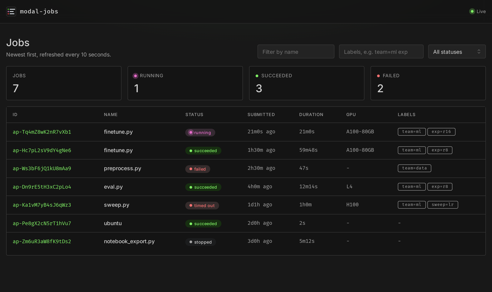
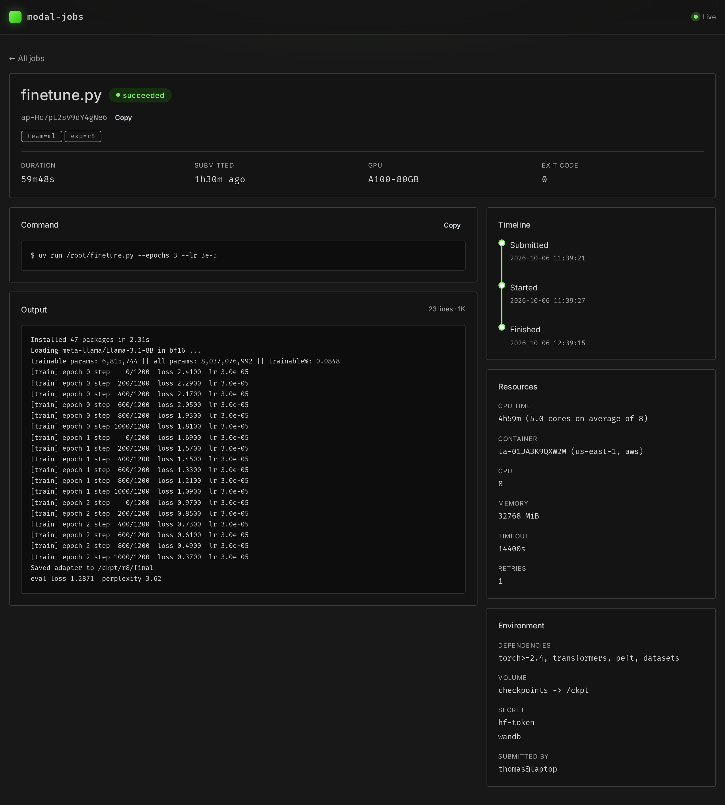

# modal-jobs

Run scripts and container commands on [Modal](https://modal.com) as tracked jobs. You can
list, inspect, stream, wait on, stop, and clean up jobs from the command line or from a web
dashboard.

```console
$ modal-jobs uv run --gpu A100-80GB -d -l team=ml -l exp=r8 finetune.py --epochs 3
Started finetune.py in the background.

Stream logs:
  modal-jobs logs --follow ap-Hc7pL2sV9dY4gNe6

Wait for it:
  modal-jobs wait ap-Hc7pL2sV9dY4gNe6

Stop the job:
  modal-jobs stop ap-Hc7pL2sV9dY4gNe6
```



## Features

- **Tracked history:** every job is recorded with its status, exit code, timestamps,
  resources, and CPU usage, and its output is saved to a Modal volume.
- **Detach and come back:** start a job with `-d`, then use `logs --follow` or `wait`.
- **Scripting friendly:** `wait` exits with the job's exit code, and `ls` and `show` can
  print JSON.
- **A read-only web dashboard**, deployed with the backend.

## Installation

You need a Modal account. Authenticate the Modal client once with `modal setup`.

Install the CLI with [uv](https://docs.astral.sh/uv/):

```bash
uv tool install git+https://github.com/thomasjpfan/modal-jobs
```

Upgrade it later with `uv tool upgrade modal-jobs`.

Then deploy the backend that tracks jobs and serves the dashboard:

```console
$ modal-jobs backend deploy
✓ Deployed the modal-jobs backend
Dashboard: https://<workspace>--modal-jobs-dashboard.modal.run
```

Run `modal-jobs backend deploy` again after upgrading modal-jobs to update the backend.

## Running jobs

### Python scripts with `uv run`

`modal-jobs uv run` runs a command on Modal with `uv run`. If the command starts with a
Python script, the script is uploaded and run with its
[inline dependencies](https://packaging.python.org/en/latest/specifications/inline-script-metadata/):

```python
# /// script
# dependencies = ["requests<3", "rich"]
# ///
import requests
...
```

```bash
modal-jobs uv run examples/02_script_deps.py

# Add packages that aren't declared in the script.
modal-jobs uv run --with rich --with "requests>=2,<3" examples/03_with.py

# Run on a GPU.
modal-jobs uv run --gpu T4 examples/05_gpu.py

# Arguments after the script are passed to it.
modal-jobs uv run --gpu A100-80GB --timeout 4h finetune.py --epochs 3

# The script may also be a URL, or `-` to read it from stdin.
modal-jobs uv run https://example.com/script.py
cat script.py | modal-jobs uv run -

# Commands that don't start with a script are run as is.
modal-jobs uv run python -c 'print("hi")'
```

### Container images with `run`

`modal-jobs run` runs a command in a registry image, like `docker run`:

```bash
modal-jobs run --add-python 3.12 docker.io/ubuntu echo hi
modal-jobs run --gpu H100 nvcr.io/nvidia/pytorch:24.05-py3 python train.py
```

### Options

`run` and `uv run` share these options:

| Option | Description |
| --- | --- |
| `--gpu GPU` | Run on a GPU, e.g. `T4`, `A100-80GB`, or `H100:8` for multiple GPUs. |
| `--cpu CORES` | Request CPU cores, e.g. `4` or `0.5`. |
| `--memory SIZE` | Request memory, e.g. `512` (MiB), `512M`, or `4G`. |
| `--timeout DURATION` | Stop the job after `90` (seconds), `10m`, `2h`, or `1h30m`. Defaults to 5 minutes, up to 24 hours. |
| `--retries N` | Retry the job up to N times if it fails, up to 10. |
| `-v, --volume SOURCE:DEST` | Mount the Modal volume SOURCE at DEST, or add the local directory SOURCE (if it starts with `.` or `~` or contains `/`). |
| `-s, --secret NAME\|KEY=VALUE` | Add the Modal secret NAME, or set KEY to VALUE as a secret. |
| `--env-file PATH` | Set the variables in a `.env` file as secrets. |
| `-d, --detach` | Start the job and return without waiting for it. |
| `--name NAME` | Name the job. Defaults to the script's filename or the image's name. |
| `-l, --label KEY=VALUE` | Label the job. May be provided multiple times. |
| `--dry-run` | Print the job's configuration without running it. |

`uv run` also takes `--with PACKAGE`, and `run` takes `--add-python VERSION`.

```bash
# Mount a Modal volume and a local directory, and add secrets.
modal-jobs uv run -v checkpoints:/ckpt -v ./data:/data -s hf-token -s WANDB_MODE=offline train.py
```

## Managing jobs

Job IDs can be shortened to any unique prefix, like `ap-Hc7p`.

### `ls`: list jobs

```console
$ modal-jobs ls
ID                   NAME                STATUS     SUBMITTED  DURATION  GPU        LABELS
ap-Tq4mZ8wK2nR7vXb1  finetune.py         running    21m0s ago  21m0s     A100-80GB  team=ml,exp=r16
ap-Hc7pL2sV9dY4gNe6  finetune.py         succeeded  1h30m ago  59m48s    A100-80GB  team=ml,exp=r8
ap-Ws3bF6jQ1kU8mAa9  preprocess.py       failed     2h30m ago  47s       -          team=data
ap-Dn9rE5tH3xC2pLo4  eval.py             succeeded  4h0m ago   12m14s    L4         team=ml,exp=r8
ap-Ka1vM7yB4sJ6qWz3  sweep.py            timed_out  1d1h ago   1h0m      H100       team=ml,sweep=lr
ap-Pe8gX2cN5rT1hVu7  ubuntu              succeeded  2d0h ago   2s        -          -
ap-Zm6uR3aW8fK9tDs2  notebook_export.py  stopped    3d0h ago   5m12s     -          -
```

Filter with `--status`, `--name`, and `--label KEY[=VALUE]` (repeat it to require several
labels). `-n` sets how many jobs to show (20 by default), and `--json` prints the records
as JSON.

```bash
modal-jobs ls --status failed
modal-jobs ls --label team=ml --label exp
modal-jobs ls --name finetune.py --json
```

### `show`: show a job's details

```console
$ modal-jobs show ap-Hc7p
ID: ap-Hc7pL2sV9dY4gNe6
Name: finetune.py
Status: succeeded
Exit code: 0
CPU time: 4h59m (5.0 cores on average of 8)
Command: uv run /root/finetune.py --epochs 3 --lr 3e-5
GPU: A100-80GB
Volume: checkpoints -> /ckpt
Label: team=ml
Duration: 59m48s
```

### `logs`, `wait`, and `stop`

```bash
# Print a job's saved output, or only the last 50 lines.
modal-jobs logs ap-Hc7p
modal-jobs logs -n 50 ap-Hc7p

# Stream the output of a running job until it finishes.
modal-jobs logs --follow ap-Tq4m

# Wait for a job to finish and exit with its exit code. Exits with 124 if --timeout passes.
modal-jobs wait ap-Tq4m --timeout 2h && echo "training done"

# Stop running jobs.
modal-jobs stop ap-Tq4m
```

`wait` exits with 0 if the job succeeded, the job's exit code if it failed, and 1 if it
timed out or was stopped.

### `rm` and `prune`: clean up

```bash
# Delete finished jobs and their saved output.
modal-jobs rm ap-Ws3b ap-Zm6u

# Delete finished jobs submitted more than 7 days ago, optionally only with one status.
modal-jobs prune --dry-run
modal-jobs prune --older-than 30d --status failed
```

`stop`, `rm`, and `prune` ask for confirmation unless you pass `-y`.

### `backend`

```bash
modal-jobs backend deploy   # Deploy or update the backend and the dashboard.
modal-jobs backend status   # Show the job counts, saved log usage, and the dashboard URL.
```

## Dashboard

The backend serves a read-only dashboard. Find its URL with `modal-jobs backend status`.

The jobs page shows job counts by status and a table of recent jobs. You can filter it by
name, label, and status, and it refreshes every 10 seconds.

Click a job to open its page. It shows the job's command and saved output, a timeline of
when it was submitted, started, and finished, and its resources and environment:



## How it works

- `modal-jobs` runs each job as a Modal function call in its own ephemeral app. The app ID
  (`ap-...`) is the job ID.
- The `modal-jobs` backend app records jobs as JSON files on the `modal-jobs-db` volume. A
  single registry container owns that volume. It checks running jobs against Modal whenever
  they're read and every 10 minutes, so jobs that finish while detached get their final
  status.
- Each job appends its output to a file on the `modal-jobs-logs` volume, which `logs`
  and the dashboard read.
- The dashboard is a [Dash](https://dash.plotly.com) app served by the same backend app.

## Development

```bash
uv sync
uv run poe check       # Check formatting, lint, and run the tests.
uv run poe format      # Format and fix lint.
uv run poe test-live   # Run the tests against Modal, in a temporary environment.
```
